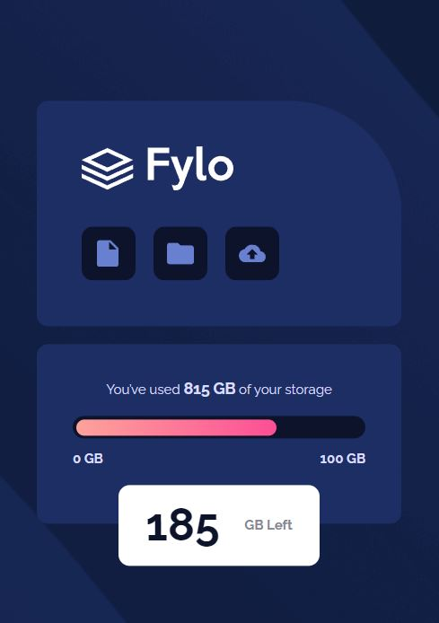
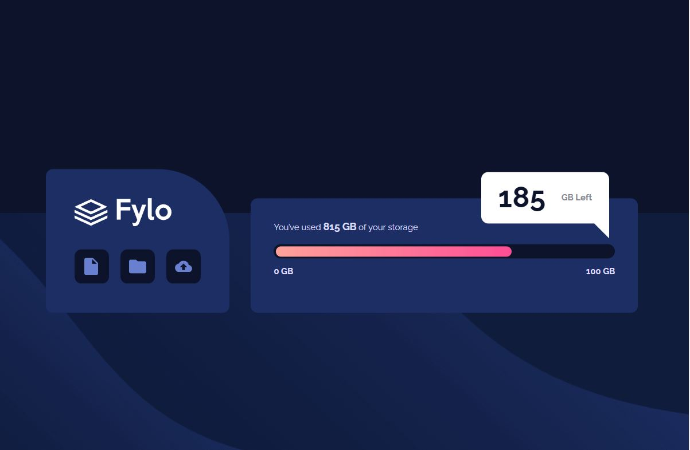

# Frontend Mentor - Fylo data storage component solution

This is a solution to the [Fylo data storage component challenge on Frontend Mentor](https://www.frontendmentor.io/challenges/fylo-data-storage-component-1dZPRbV5n). Frontend Mentor challenges help you improve your coding skills by building realistic projects. 

## Table of contents

- [Overview](#overview)
  - [The challenge](#the-challenge)
  - [Screenshot](#screenshot)
  - [Links](#links)
- [My process](#my-process)
  - [Built with](#built-with)
  - [What I learned](#what-i-learned)
  - [Continued development](#continued-development)
  - [Useful resources](#useful-resources)
- [Author](#author)
- [Acknowledgments](#acknowledgments)

### The challenge

Users should be able to:

- View the optimal layout for the site depending on their device's screen size

### Screenshot

### Links

- Solution URL: [solution URL here](https://github.com/neo2enigma/fylo-data-storage-component-master)
- Live Site URL: [live site URL here](https://neo2enigma.github.io/fylo-data-storage-component-master/)

## My process
First I tried to understand each part of design and group them as possible. creating cards with exact margin and padding was a little tricky. Finally in desktop version I used 2 media query to make it desktop friendly.

### Built with

- Semantic HTML5 markup
- CSS custom properties
- Flexbox
- Mobile-first workflow

### What I learned

Mobile-First design is a correct approach for a front-end developer. It will help to make the design for desktop with a few css properties.

### Useful resources

- [Bubbly](https://projects.verou.me/bubbly/) - This helped me for creating speech bubble.
- [Codepen](https://codepen.io/ronarr/pen/LYYBOJP) - This is an amazing article which helped me finally understand color gradient in web.

## Author

- Frontend Mentor - [@devedoping](https://devedoping.ir/intro/)
- Linkedin - [@kamran-safaei](https://www.linkedin.com/in/kamran-safaei/)